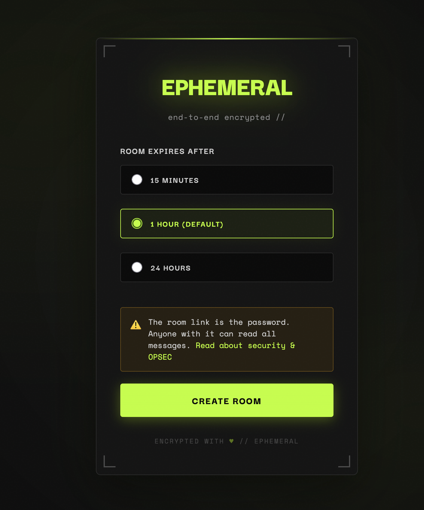
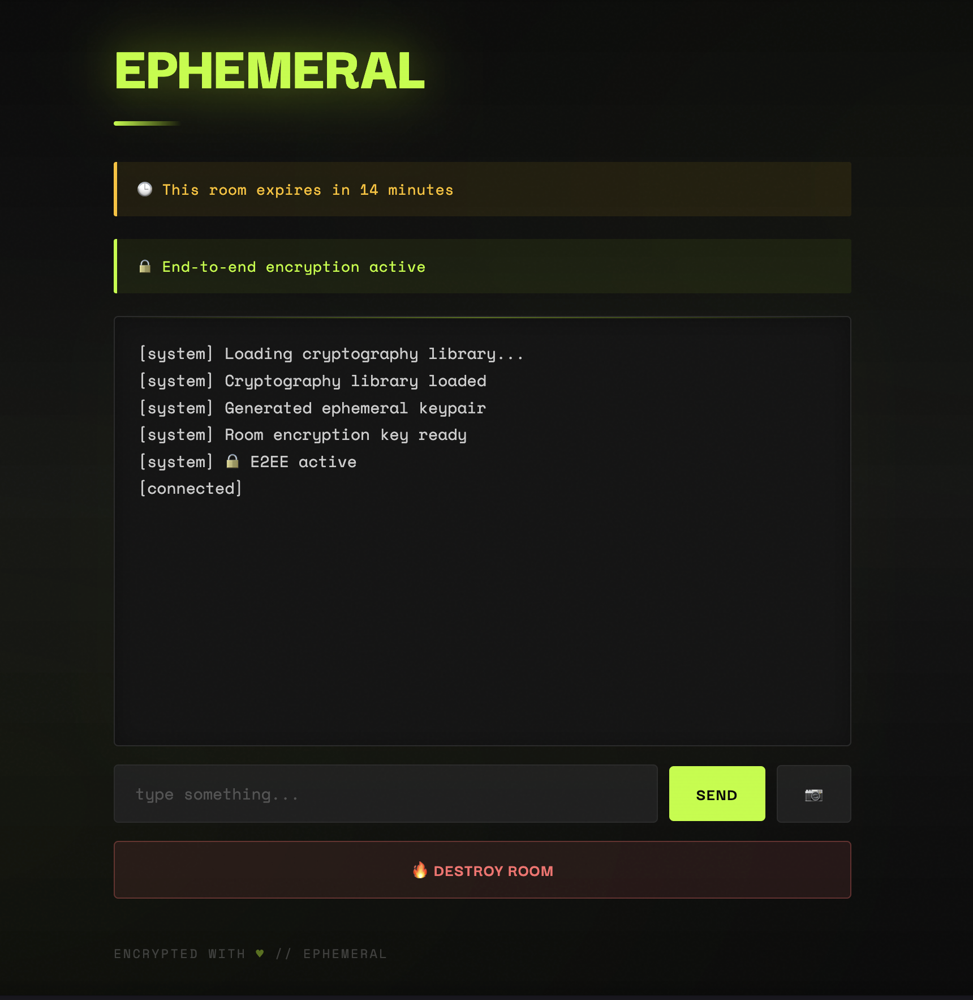

# Ephemeral

**End-to-end encrypted ephemeral chat with cross-device support.**

Send messages and images that disappear when the room expires. Access the same conversation from any device with just the room URL.

<p align="center">
  
  
</p>

---

## ✨ Features

- 🔒 **End-to-end encryption** - XChaCha20-Poly1305 AEAD cipher
- 📱 **Cross-device access** - Open the same room on multiple devices
- 📜 **Message history** - Automatic replay after reconnection
- 🖼️ **Encrypted images** - Send images up to 5MB (chunked & encrypted)
- ⏰ **Auto-expiring rooms** - Configurable TTL (default: 24h)
- 💾 **SQLite storage** - Encrypted messages stored on disk, auto-deleted on expiry
- 🧅 **Tor-friendly** - No external dependencies, fully self-contained
- 🎨 **Minimal UI** - Clean terminal-inspired interface

---

## 🚀 Quick Start

### Run the Server

```bash
go run ./cmd/ephemeral
```

Server starts on `http://127.0.0.1:4000`

### Create a Room

```bash
curl -X POST http://127.0.0.1:4000/create
```

Response:
```json
{
  "url": "/#abc123...",
  "expires_at": "2026-01-11T12:00:00Z"
}
```

### Open in Browser

```
http://127.0.0.1:4000/#abc123...
```

E2EE activates immediately. Send messages and images - they're encrypted before leaving your device.

---

## 🔒 Security Model

### How It Works

1. **Deterministic Key Derivation**
   ```
   roomHash = SHA256(roomToken)
   encryptionKey = KDF(roomHash, "ephemeral-room-v1")
   ```

2. **Encryption**: XChaCha20-Poly1305 with random 24-byte nonces
3. **Server Role**: Blind relay - cannot decrypt messages
4. **Client-Side**: All crypto happens in browser via libsodium.js

### What This Means

✅ **Protects Against:**
- Network eavesdropping (without room URL)
- Server operator reading messages (encrypted at rest in SQLite)
- Database theft (messages are encrypted, only decryptable with room URL)

⚠️ **Does NOT Protect Against:**
- URL compromise (room URL = decryption key)
- Endpoint compromise (malware on device)
- Active attackers with room URL

### Architecture Trade-Off

**Chosen**: Cross-device access + message history
**Cost**: No forward secrecy (room URL acts as symmetric key)

This design prioritizes usability for ephemeral conversations where participants trust each other with the room URL.

---

## 📁 Project Structure

```
ephemeral/
├── cmd/ephemeral/          # Server entry point
├── internal/
│   ├── httpx/              # HTTP & WebSocket handlers
│   ├── rooms/              # Room & message management (SQLite)
│   └── notify/             # Optional notification hooks
├── migrations/             # SQLite schema migrations
├── ui/
│   ├── app.js              # E2EE client implementation
│   ├── index.html          # Chat UI
│   └── vendor/sodium.js    # libsodium.js (vendored)
└── docs/
    ├── E2EE-IMPLEMENTATION.md   # Detailed crypto spec
    ├── QUICKSTART.md            # Quick testing guide
    └── TESTING-GUIDE.md         # Security test scenarios
```

---

## 🧪 Testing

See [QUICKSTART.md](QUICKSTART.md) for quick testing instructions.

See [TESTING-GUIDE.md](TESTING-GUIDE.md) for security validation tests.

See [E2EE-IMPLEMENTATION.md](E2EE-IMPLEMENTATION.md) for complete cryptographic protocol details.

---

## 🛠️ Configuration

Environment variables:

```bash
EPHEMERAL_DB_PATH=/var/lib/ephemeral/data.db   # SQLite database path
ROOM_TTL=24h                                    # Room expiration time (default: 24h)
```

---

## 🎯 Use Cases

- **Quick secure chats** - Share sensitive info without leaving a trace
- **Cross-device messaging** - Continue conversation on phone/laptop/tablet
- **Collaborative work** - Share text and images temporarily
- **Privacy-conscious comms** - Self-hosted, no third parties

---

## ⚠️ Limitations

- **No forward secrecy** - Room URL compromises all messages
- **No identity verification** - Can't prove who you're talking to
- **Disk persistence** - Encrypted messages stored in SQLite until expiry
- **Trust on first use** - No protection against MITM during setup
- **Database forensics** - Deleted SQLite records may be recoverable with forensic tools

This is **not** a Signal/Matrix replacement. It's designed for ephemeral, consensual conversations where simplicity matters more than threat-model completeness.

---

### Optional Signal Notification Hook

Ephemeral can optionally emit lifecycle events to a local notification script.

The hook is executed as:

/usr/local/bin/ephemeral-notify.sh "<event message>"

This script is not part of the repository and must be implemented by operators.
It typically wraps tools such as signal-cli, but no credentials or phone numbers
are ever stored in this codebase.

---

## 🤝 Contributing

See [E2EE-IMPLEMENTATION.md](E2EE-IMPLEMENTATION.md) for implementation details.

---

## 📜 License

MIT

---

**Built with ♥ for ephemeral conversations.**